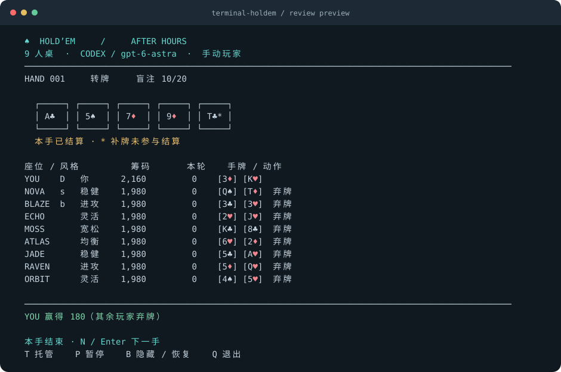

# ♠ Terminal Hold’em

**在终端里，和 8 位 Codex 对手打德州扑克。**

休息时开一桌，自己出牌，也可以按 T 让 Codex 接管。每手结束，所有人的底牌一起亮出来，看看刚才谁在诈唬。仅使用虚拟筹码。

[开始第一手](#开始第一手) · [操作按键](#操作) · [运行测试](#规则与测试)



*界面样例：转牌时其余玩家弃牌，最后一张公共牌补出供复盘，标记 `*`。示例由固定牌局生成。*

- **和模型同桌。** 八位对手由真实 Codex CLI 决策，各自加载独立策略 skill，结合赔率、行动加权抽样和公开统计；连接失败时暂停，可重试。
- **随时交接。** 自己玩、托管自己，或观看整桌 AI 对战；B 可立即切到终端隐藏页。
- **结束后看清每张牌。** 弃牌也亮底牌，提前结束也可看到剩余公共牌的复盘补牌。

Python 3.11+，无第三方 Python 依赖。需要本机安装并登录 Codex CLI。macOS / Linux 默认使用 `curses` 全屏界面；不支持 curses 的环境可用 `--plain`。

## 开始第一手

```bash
git clone https://github.com/rzr002/terminal-holdem.git
cd terminal-holdem
codex login
python3 play.py
```

已经下载项目并登录 Codex，直接运行 `python3 play.py` 即可。尚未安装 CLI，可参考 [Codex CLI 安装说明](https://developers.openai.com/codex/cli)。

默认是 **九人满员桌：你 + 8 位 Codex 模型对手**，每人 2,000 筹码，盲注 10/20。可用 `--players 2` 到 `--players 9` 调整人数。推荐终端窗口为 **100 列 × 36 行**，最低 72 × 24；小窗口会自动切换紧凑布局，九个座位都可见。

默认采用**先看翻牌**桌风，顶部显示「先看翻牌」：普通 100 BB 深度下，翻前累计下注不超过 6 BB（默认 120 筹码）时，自动牌手连 72o 这样的弱牌也会继续，看到三张公共牌再判断。未开池最多加到 3 BB，已有加注就平跟，避免对手之间连续抬价。

这个偏好通过 Codex 的可选动作和输出 schema 生效，模型仍实际选择跟注、过牌或小加注，程序不会把它的弃牌改写成跟注。手动玩家照常出牌。有效筹码不足 20 BB、整轮成本超过有效筹码 12%、跟注会耗尽筹码或面对主动全押时，恢复完整判断；翻牌发出后也恢复正常策略。反复全押的公开统计与防守调整继续保留。

本轮[真实 Codex 整桌验证](validation/codex-flop-first-smoke.json)：9 次决策、首轮零弃牌，9 人都进入翻牌，耗时约 80 秒。这是普通初始筹码下的一桌实测，面对高额下注或全押时人数仍由决策决定。

模型行动会使用你已有 Codex 账户的额度，需要等待响应。一次九人短筹码实测完成 18 次决策、耗时约 169 秒，实际时间随模型、网络和行动次数变化。

## 使用 Codex 牌手

先安装并登录本机 Codex CLI，然后运行：

```bash
codex login
python3 play.py --check-codex
python3 play.py --agent codex
```

在交互终端启动时，会先显示本机 Codex 的模型列表，输入编号即可开局，Enter 沿用当前配置。候选列表读取 `$CODEX_HOME/models_cache.json`（默认 `~/.codex/models_cache.json`），隐藏模型不会列出；没有缓存时仍可手动输入模型 ID。列表反映本机缓存，实际可用性以账户为准。

游戏中按 **M** 打开模型菜单，用方向键或编号选择、Enter 确认；按 I 可手动输入模型 ID，Esc 返回牌桌。切换应用于全部 Codex 对手和托管玩家，**从下一次决策生效**；已经发出的请求会完成，牌局和筹码继续保留。选择只在本次游戏生效。

例如直接选择 `gpt-5.4-mini`，跳过启动菜单：

```bash
python3 play.py --agent codex --model gpt-5.4-mini

# 查看候选模型，不发出模型请求
python3 play.py --list-models

# 单独测试选定模型能否返回合法决策
python3 play.py --check-codex --model gpt-5.4-mini
```

`--model` 接受任意有效模型 ID，不限于列表。模型信息可参考 [Codex 模型文档](https://learn.chatgpt.com/docs/models)。无界面、管道输入和 `--check-codex` 不弹出启动菜单，省略 `--model` 时沿用 Codex 配置。

2026-09-08 已用本机账户分别验证 Mini、Spark、Luna 能返回合法决策，见[真实连接记录](validation/model-selection-smoke.json)。记录中的单次耗时用于确认功能，不能作为稳定速度排名。

省略 `--agent` 时为 `codex`。`--agent auto` 仅作为旧参数的兼容别名，同样只调用 Codex。

每次需要行动时，程序通过 [Codex 非交互模式](https://developers.openai.com/codex/noninteractive) 调用 `codex exec`，使用 JSON Schema 接收决策。这会使用你本机 Codex 账户的额度；延迟取决于模型与连接。程序沿用 CLI 保存的认证，自动读取本机 Codex 配置中的模型名称，也可用 `--model` 覆盖。采用临时工作目录、只读沙箱和临时会话，关闭 shell、应用、插件、hooks 和多代理功能；其余用户配置通过 `--ignore-user-config` 隔离，自定义 provider/profile 配置暂未接入。

程序会将 macOS 已配置的系统代理传给 Codex 子进程。已有的代理环境变量优先；不会修改系统代理或 shell 设置。

单次请求默认最多等待 60 秒，可用 `--timeout 90` 调整。连接失败、超时或返回非法动作时，会显示 `CODEX / 连接失败`，**停在当前行动，不会改用本地策略**。按 R 重试 Codex，也可按 M 换模型后再按 R 重试，按 Q 退出；当前底牌、下注和行动顺序保持不变。无界面模式遇到失败会输出错误并以退出码 1 停止。`--check-codex` 仅发出一次真实请求，失败时退出码也为 1。

Codex 与本地策略都只接收该座位的底牌、公共牌、公开下注记录及合法动作；不接收其他底牌、剩余牌堆或发牌随机种子。对手的决策理由也不会写进你能看到的行动记录。

## 对手策略

| 对手 | 策略侧重 |
| --- | --- |
| NOVA | 活跃价值，小注多参与，强牌敢跟压力 |
| BLAZE | 位置施压、3-bet、半诈唬 |
| ECHO | 混合线路、保护过牌范围 |
| MOSS | 深筹码、隐含赔率、坚果潜力 |
| ATLAS | 范围、赔率与下注尺度 |
| JADE | 根据有样本量的公开统计调整 |
| RAVEN | 阻断牌与河牌极化 |
| ORBIT | 短筹码、有效筹码与边池 |

每次模型请求实际加载 [共享策略](skills/poker-core/SKILL.md) 和当前角色的 `SKILL.md`；YOU 托管也有自己的 skill。辅助计算提供 192 次行动加权抽样、跟注赔率、可争夺底池、位置和合法下注总额。角色只在可见信息内独立竞争，翻前遵守先看翻牌的桌风，翻牌后发挥不同风格。

辅助数据明确区分「所有未弃牌者都摊牌」的权益与「只和全押者单挑」的权益，避免将还没行动的玩家都当作会跟注。公开统计单独记录主动全押手数；至少三手观察中已有两手以上主动全押、比例至少 40% 时，会温和放宽对该对手的范围判断。跟注至全押不计作主动施压，统计也不使用其他人的底牌。

上一轮放宽范围时，程序版的主动入池比例从约 15% 增至 41%，有翻牌的牌局平均参与人数从 2.16 增至 4.15。记录见 [调整前](validation/table-activity-before.json)和[调整后](validation/table-activity-after.json)；这些是“先看翻牌”约束加入前的历史记录。

[真实 Codex 场景检查](validation/codex-table-style-smoke.json)九项通过：四个角色用可玩牌跟小开池，另四个角色用合理牌力跟反复全押者，垃圾牌仍能弃牌。场景检查验证指定行为，不衡量长期胜率。

这些是增强后的决策指导和启发式计算，尚未完成强化学习训练或职业强度验证。[扑克 AI 调研与角色 skill 索引](docs/poker-ai-research.md)说明 Pluribus、DeepStack、RLCard、OpenSpiel 与当前九人桌的区别。

[训练牌手接入方案](docs/trained-opponents-feasibility.md)进一步核验了 RLCard / OpenSpiel 的九人运行条件，并附可复现的小型 CFR 学习实验；这些框架尚未作为游戏对手接入。

程序版可以显式选择，不需要模型请求：

```bash
python3 play.py --agent strategic
```

它用位置范围、行动加权抽样和下注规则出牌，界面明确显示 `STRATEGIC / 程序策略`。默认仍使用 Codex。

## 操作

| 按键 | 动作 |
| --- | --- |
| `F` | 弃牌 |
| `C` | 无人下注时过牌，否则跟注 |
| `R` | 输入本轮下注**总额**，Enter 确认，Esc 取消；连接失败时重试 Codex |
| `A` | 全押；仅在规则允许时可用 |
| `T` | 开关你的 AI 托管；关闭后在当前决策完成时交还控制 |
| `M` | 选择 Codex 模型；当前请求完成后，后续决策使用新模型 |
| `P` | 暂停 / 继续 |
| `B` | 立即隐藏牌桌，显示静态 service-monitor 画面；再次按 B 恢复 |
| `N` / Enter | 本手结束后开始下一手 |
| `?` | 简短帮助 |
| `Q` / Ctrl-C | 退出并清理正在运行的牌手进程 |

例如你本轮已经投入 20，想再投入 80：按 `R`，输入 **100**，按 Enter。不是输入 80。界面会显示当前跟注金额和可加注范围。

`B`、`P` 和 `M` 在 Codex 思考时也能响应。隐藏、暂停或打开模型菜单期间，已经发出的模型请求可以完成，但牌局不会应用其结果或继续推进，直到恢复。模型菜单也支持 B 隐藏，手动输入模型 ID 时用 Ctrl-B 隐藏。隐藏页只是界面内容切换，无法隐藏操作系统进程或外部终端录制。程序使用终端备用屏幕，退出后回到原命令行。

逐行模式用 `r 100` 这类命令并回车；支持 F/C/R/A/T/M/Q，可在自己行动时、手牌结束时或连接失败后输入 M 换模型，**不支持思考期间即时换模型、隐藏、暂停或托管中的即时接管**。

## 常用模式

```bash
# 你亲自玩，Codex 扮演对手
python3 play.py --agent codex

# 启动即托管，可按 T 接管
python3 play.py --agent codex --autoplay

# 全 AI 观战，只打 10 手
python3 play.py --agent codex --watch --hands 10

# Codex 六人桌
python3 play.py --players 6 --stack 1000 --big-blind 10

# Codex 自动跑局并输出 JSON，不显示牌桌
python3 play.py --headless --hands 1 --seed 42

# 兼容不支持全屏界面的终端
python3 play.py --plain
```

`--watch` 固定为全 AI；`--autoplay` 可以通过 T 交还玩家座位。每手进行中隐藏对手底牌；**本手结束后公开所有已发出的底牌，包括弃牌玩家的牌**，并展示五张公共牌，方便复盘。若因其他玩家全部弃牌而提前结束，按原牌堆顺序和烧牌规则补齐剩余公共牌，补牌标记 `*`，界面注明「补牌未参与结算」。这只是结束后的复盘展示，胜负和筹码按实际结束时的情况结算，补牌也不会传给 Codex。手动模式按 N / Enter 才开始下一手；观战和托管模式可按 P 暂停查看。

普通对局直到只剩一人，或达到 `--hands` 指定手数。筹码为零的座位自动跳过；退出后不保存进度，不包含联网真人多人模式、充值或提现。

## 规则与测试

实现无限注德州扑克：两张底牌、翻牌/转牌/河牌、烧牌、五张最佳牌、A2345 顺子、踢脚比较、单挑行动顺序、全押、多个边池、未跟注筹码退回，以及平局分池。奇数筹码按庄家左侧优先分配；不足额加注不会重新开放已行动玩家的加注权，累计达到完整加注额时重新开放。这些边界参考 [Poker TDA 规则和示例](https://www.pokertda.com/view-poker-tda-rules/)。这是固定盲注的休闲桌，采用存活座位之间移动庄家的方式，不模拟正式赛事的死庄、盲注升级和现场裁决。

仅为离线开发测试保留显式的 `--agent local`：它采用随机抽样策略，不是 Codex 模型。游戏不会自行选择这个模式。

```bash
python3 -m unittest discover -s tests -v
```

测试覆盖牌型、九人桌行动顺序、加注权限、边池与平分、短盲注、筹码守恒、进行中隐藏信息、结束后全部亮牌、复盘补牌不改变结算、小窗口九个座位可见、真实子进程协议、系统代理传递、默认使用 Codex、失败时不替换对手、超时和取消、输入校验及完整自动对局。测试不会调用付费模型；真实连接单独使用 `--check-codex` 检查。

2026-09-08 已完成真实联调：使用本机配置的 `gpt-6-astra` 和系统代理跑完一手九人全 AI 对局，18 次动作全部来自 Codex，耗时约 169 秒，筹码结算守恒，无本地策略参与。记录见 [validation/codex-nine-seat-smoke.json](validation/codex-nine-seat-smoke.json)；早期四人桌验证保留在 [validation/codex-smoke.json](validation/codex-smoke.json)。

代码入口是 `play.py` 或 `python3 -m holdem`。`holdem/engine.py` 负责规则，`agents.py` 负责牌手，`ui.py` 负责显示与操作。

项目介绍使用 [marketingskills](https://github.com/coreyhaines31/marketingskills) 的产品定位与文案技能整理，依据记录在 [.agents/product-marketing.md](.agents/product-marketing.md)。
